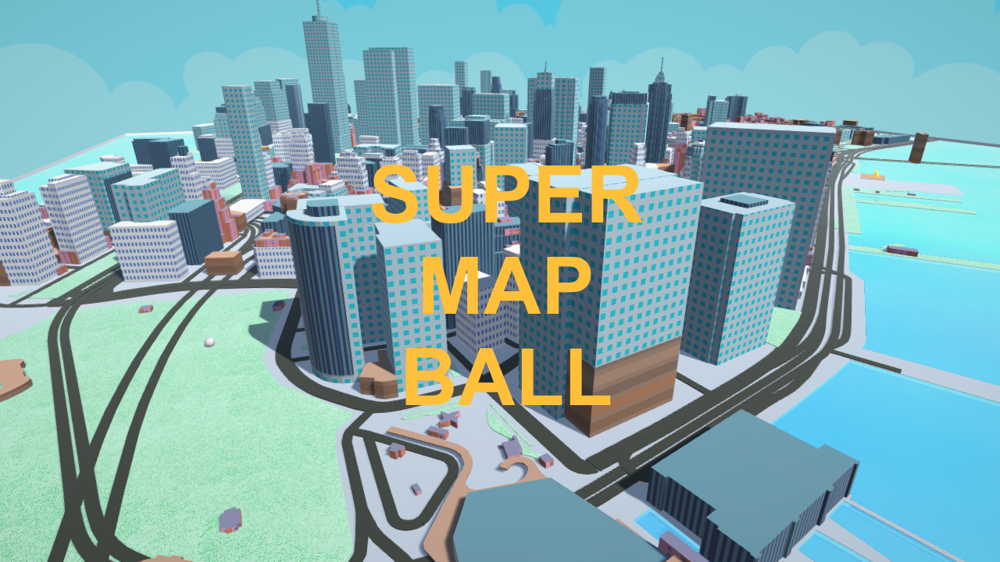
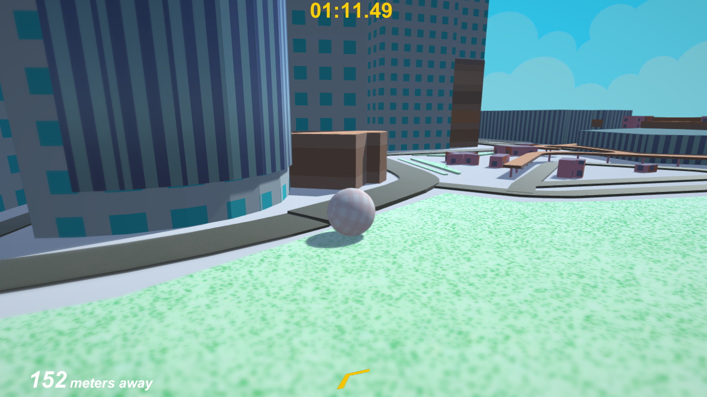
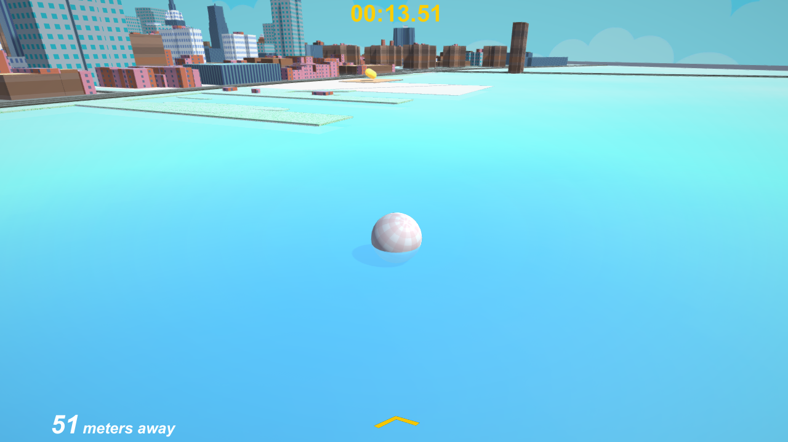

SUPER MAP BALL
==============

This is a small game project used to develop and demonstrate [Tangram Unity](https://github.com/tangrams/tangram-unity). The city geometry is all generated by Tangram Unity using OpenStreetMap data provided by Mapzen vector tiles.

